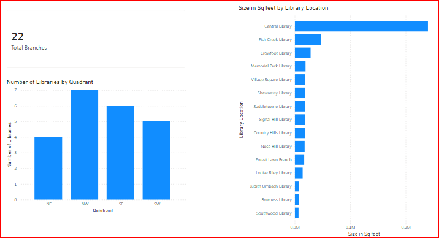

# Calgary Public Library — Branch Analysis

**Tools used:** Power BI · DAX · SQL  
**Dataset:** [Calgary Public Library Locations and Hours](https://data.calgary.ca/Recreation-and-Culture/Calgary-Public-Library-Locations-and-Hours/m9y7-ui7j/)  
**Status:** Complete

---

## Project Overview

Analyzed Calgary Public Library branch data to understand how library 
services are distributed across the city's quadrants and by branch size. 
Built a Power BI dashboard using calculated columns (DAX) to derive 
additional insights not present in the raw dataset.

---

## Questions I Explored

- How are library branches distributed across Calgary's quadrants?
- How does branch size vary across locations?
- What is the total number of active library branches in Calgary?

---
## Key Findings

- The NW quadrant has the highest concentration of branches (7), followed by SE (6), SW (5), and NE (4)
- Central Library is by far the largest branch by square footage, followed by Fish Creek Library and Crowfoot Library; the remaining branches are comparatively small and similar in size
- Calgary Public Library operates 22 total branches citywide
---
## DAX Formulas Used

**Quadrant extraction** — derived from the address field since no quadrant column existed in the raw dataset:

```dax
Quadrant = 
IF(RIGHT(library_locations[address], 2) = "NW", "NW",
IF(RIGHT(library_locations[address], 2) = "NE", "NE",
IF(RIGHT(library_locations[address], 2) = "SW", "SW",
IF(RIGHT(library_locations[address], 2) = "SE", "SE", "Unknown"))))
```

**Total branch count** — used for the KPI card:

```dax
Total Branches = COUNT(library_locations[name])
`

---

## Dashboard Preview



---

## Files in This Repository

| File | Description |
|------|-------------|
| `library_locations.png` | Power BI dashboard — branch size, quadrant breakdown, total count |
| `library_locations.csv` | Source dataset exported from Calgary Open Data |
| `queries.sql` | SQL queries used for supplementary data analysis |

---

## Skills Demonstrated

- Power BI: report building, calculated columns (DAX), data visualization
- DAX: custom column creation for derived insights (e.g. quadrant extraction)
- SQL: filtering, aggregation, and reporting queries
- Domain knowledge: Calgary Public Library operations 
- Data interpretation and dashboard storytelling

---

## About Me

Junior Data Analyst based in Calgary, AB. Background in IT support, 
data reporting, and library systems. Open to entry-level data and 
AI-adjacent analyst roles.

📧 hjoumaa818@gmail.com
